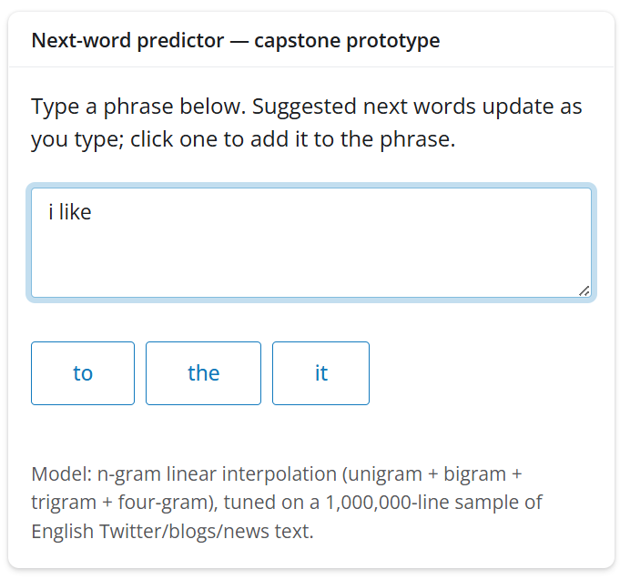

```{r setup}
library(data.table)
library(scales)

out_dir <- "../data/processed"
model_config     <- readRDS(file.path(out_dir, "model_config.rds"))
test_eval        <- readRDS(file.path(out_dir, "model_eval_test.rds"))
model_sizes      <- readRDS(file.path(out_dir, "model_sizes.rds"))
comparison       <- readRDS(file.path(out_dir, "model_comparison.rds"))
raw_stats        <- as.data.table(readRDS(file.path(out_dir, "raw_stats.rds")))
coverage_summary <- readRDS(file.path(out_dir, "eda_coverage_summary.rds"))
```

## How It Works

A model trained on **`r comma(sum(raw_stats$n_words))` words** of real
Twitter posts, blogs, and news articles learns which words tend to follow
which — at four levels of specificity: single words, pairs, triples, and
quadruples.

::: {.fragment}
When someone types a phrase, the model blends evidence from *all* the
context lengths it has evidence for — weighting longer, more specific
matches more heavily — rather than betting everything on one context length:
:::

::: {.fragment}
> "thanks for the" → **follow** (49%), **rt** (24%), **first** (9%)

> "i love" → **you** (44%), **the** (19%), **it** (15%)
:::

::: {.fragment}
If a typed phrase was never seen in training, the model gracefully falls
back to shorter, more general context — so it always has *something*
sensible to suggest.
:::

## How Good Is It? {.smaller}

Tuned and evaluated the honest way: 80% of a 1,000,000-sentence sample to
learn from, 10% held out to tune settings, and a final 10% touched only
once to report these numbers.

::: {.columns}
::: {.column width="55%"}
**Blending contexts beats picking one:**

| Strategy | Accuracy (tuning set) |
|---|---|
| Single best context (Stupid Backoff) | `r percent(comparison$dev_accuracy[1], accuracy=0.1)` |
| **Blended contexts (ours)** | **`r percent(comparison$dev_accuracy[2], accuracy=0.1)`** |
:::

::: {.column width="45%"}
**Final, untouched test results:**

- Top-3 accuracy: **`r percent(test_eval$top3_accuracy, accuracy=0.1)`**
- Model footprint: **`r round(sum(model_sizes$size_mb))` MB**
:::
:::

::: {.fragment}
For scale: just **`r coverage_summary[coverage==0.5, n_words_needed]` words**
account for half of everything people actually type — the model focuses its
memory on the words and phrases that matter most.
:::

## See It In Action

::: {.columns}
::: {.column width="55%"}

:::

::: {.column width="45%"}
Type a phrase &rarr; suggestions update live &rarr; click one to add it.

**Try it yourself:** [Wordprediction App](https://renesiodlaczek-wordprediction.share.connect.posit.cloud/)

 
:::
:::

::: {.fragment}
One text box. Three suggestions. No learning curve.
:::

## Why It's Ready

::: {.incremental}
- **Fast & light** — ~112 MB, comfortably within a 4GB server budget
- **Honestly evaluated** — tuned and tested on data it never trained on
- **Safe by design** — a built-in profanity filter, never suggests offensive words
- **Deployed today** — live on Posit Connect Cloud
:::

::: {.fragment}
**Next up:** train on the full 100M-word corpus (not just our 1M-sentence
sample) to sharpen predictions further, and explore more advanced smoothing
if returns start to plateau.
:::
